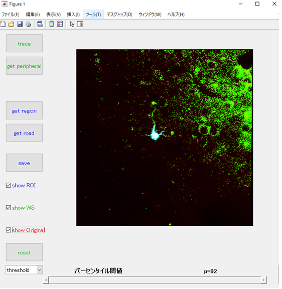

# GUI_ROI_tool
the GUI tool for taking a region of interest (ROI) from a fluorescence image

# Dependencies
MATLAB

Image processing toolbox

# Usage
Open "Get_ROI.m" and run the code (F5 or RUN). Select the image (tif file).
Image must be the 8 or 16 bit grascale tif image.

"Get_ROI.m"を開いて、F5または実行ボタンで実行すると、画像選択画面が現れる。ROI取りをしたい画像を選択する。
画像は8または16bitのグレースケールのtif画像である必要がある。

# Usage of GUI

# Demos
